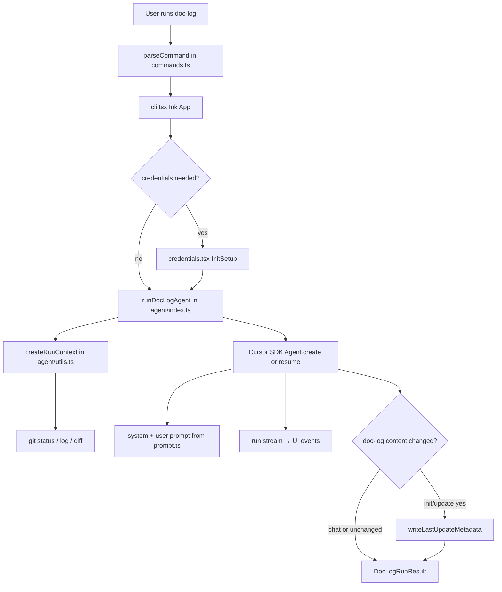

# Architecture Overview

Doc-Log is a Node.js CLI with a React/Ink terminal UI that orchestrates a Cursor SDK agent. The agent inspects the **target repository** (the process `cwd`) and writes Markdown to `doc-log/`. This page describes how the pieces connect inside the Doc-Log package itself.

## End-to-end flow



**Target repo vs Doc-Log repo:** The CLI is installed globally or via `node dist/cli.js`, but every run uses `process.cwd()` as the repository to inspect and document. Doc-Log source code is not modified during normal runs.

## CLI layer

### Entry bootstrap (`src/cli.tsx` bottom)

The CLI entry point:

1. Parses argv with `parseCommand`.
2. For `--doctor`, runs `runDoctor()` and exits.
3. For normal runs (not `--dry-run`), calls `loadDocLogEnv()` before UI startup.
4. Applies `resolveStartupCommand` — enforces API key for non-interactive/print runs.
5. Routes to `runPrintCommand` (stdout-only), Ink `<App>`, or startup error.

`--dry-run` (requires `DOC_LOG_DEV=1`) skips env loading and agent invocation; it renders `DryRunView` showing the planned command, model, and message.

### Argument parsing (`src/commands.ts`)

`parseCommand(argv)` maps argv to a `CliCommand`:

| Kind     | Trigger              | Behavior                          |
| -------- | -------------------- | --------------------------------- |
| `help`   | `--help`, `-h`       | Print usage via `getHelpText()`   |
| `doctor` | `--doctor`, `doctor` | Run diagnostics (`doctor.ts`)     |
| `run`    | default              | Interactive or one-shot agent run |
| `error`  | invalid flags        | Exit code 1 with message          |

Run commands resolve to a `DocLogCommand`: `"chat"` (default), `"init"`, or `"update"`. Flags:

- `--print` / `-p` — non-interactive; print final assistant text and exit
- `--modelId` — per-run model override (validated by `isValidModelId` in `constants.ts`)
- `--dry-run` — only when `DOC_LOG_DEV=1` or `NODE_ENV=development`

Init and update cannot be combined.

### Terminal UI (`src/cli.tsx`)

The main entry renders an Ink `App` that:

1. Optionally runs **credential setup** (`InitSetup`) when `CURSOR_API_KEY` or default model is missing.
2. Invokes `runDocLogAgent` with streaming events mapped to a run log (text, tool start/end, debug).
3. Supports **follow-up chat** in the same session by reusing a stable `threadId` (`createDocLogThreadId(process.cwd())`).
4. Handles `--print` mode by auto-exiting after success.

Development mode (`DOC_LOG_DEV=1`) exposes extra help sections and `--dry-run`.

**Startup modes:**

| Mode                          | Behavior                                                              |
| ----------------------------- | --------------------------------------------------------------------- |
| Interactive chat              | Opens input; user can type messages or slash commands                 |
| `doc-log --init` / `--update` | Runs once, auto-exits on success (`shouldAutoExitStartupRun`)         |
| `doc-log -p "..."`            | Non-interactive; streams assistant text to stdout (`runPrintCommand`) |
| `--dry-run`                   | Shows execution plan without calling the agent or reading credentials |

**Slash commands** in interactive follow-up mode: `/init`, `/update`, `/model`, `/provider`, `/clear`, `/help`, `/exit` — implemented in `ChatInput` within `cli.tsx`.

**Follow-up vs startup prompts:** When `isFollowup` is true (interactive chat after the first turn), `createRunUserMessage` in `src/agent/index.ts` sends only the trimmed user message — not the system prompt, git context, or mode instructions. Startup runs (`--init`, `--update`, first chat message) always send the full prompt bundle from `createSystemPrompt` + `createUserPrompt`.

### SDK bootstrap (`src/sdk-bootstrap.ts`)

Imported first from `cli.tsx` before other modules. Resolves `rg` (ripgrep) for the Cursor SDK by checking, in order:

1. Existing `CURSOR_RIPGREP_PATH` env var (absolute path)
2. `@cursor/sdk-<platform>-<arch>` bundled binary
3. Cursor/VS Code editor install paths
4. `rg` on PATH (`where` on Windows, `which` elsewhere)

Sets `process.env.CURSOR_RIPGREP_PATH` when found so agent tooling can search the target repo.

## Agent orchestration (`src/agent/index.ts`)

`runDocLogAgent(command, cwd, options)` is the core runtime:

1. **Load env** — `loadDocLogEnv()` merges `~/.doc-log/.env` into `process.env` (shell env wins).
2. **Validate API key** — requires `CURSOR_API_KEY`.
3. **Build context** — `createRunContext` supplies git summary and prior `.last-update.json` for init/update.
4. **Snapshot before run** — for init/update, hash `doc-log/` content (excluding `.last-update.json`) to detect real doc changes afterward.
5. **Create or resume agent** — looks up `agentId` in `~/.doc-log/threads.json` by `threadId`; resumes via `Agent.resume` or creates with `Agent.create` scoped to `local.cwd`.
6. **Send prompt** — concatenates system prompt, user prompt, and repository root note.
7. **Stream** — maps SDK messages to `DocLogRunEvent` for the UI.
8. **Write metadata** — if init/update and snapshot hash changed, writes `doc-log/.last-update.json`.

Thread IDs are SHA256-based per resolved cwd plus a random suffix. Thread map keeps at most 50 entries.

### Event mapping

SDK assistant text and tool calls become UI events (`src/agent/types.ts`):

- `text` — assistant message chunks
- `tool_start` / `tool_end` — tool invocation lifecycle
- `debug` — when `DOC_LOG_DEBUG=1`

## Prompts (`src/agent/prompt.ts`)

The documentation agent receives a large **system prompt** embedded in the user message (see `createRunUserMessage`). It defines:

- **Run discipline** — work only in target repo, targeted discovery, no invented APIs
- **Subagent discipline** — read-only parallel research; main agent writes docs
- **Planning** — temporary `doc-log/_plan.md`, deleted before completion
- **Git discipline** — log/blame for init; diff since `gitHead` for update
- **Documentation structure** — `quickstart.md` entrypoint, section dirs when warranted, max ~8 pages on init
- **Mode behavior** — `chat` vs `init` vs `update` (surgical updates, soft diff budget)
- **Security** — no reading `.env` secrets; only edit `doc-log/` and top-level agent instruction files

User prompts add git context from `createRunContext` and optional user message appendices.

**Important:** Changes to `prompt.ts` affect documentation behavior in every repository Doc-Log runs against. Treat prompt edits as product-level changes.

## Git and metadata (`src/agent/utils.ts`)

### Run context

For `init` and `update`, `createGitSummary` runs:

- `git status --short`
- `git rev-parse HEAD`
- For **update** with prior metadata: `git log <gitHead>..HEAD` or fallback `git log --since <updatedAt>`
- For **init** (or update without metadata): recent `git log --max-count=20`
- `git diff --name-status HEAD`

Git failures are captured as command output rather than crashing the run (empty repos or no commits produce "(no output)" sections or stderr text in the summary). When `git rev-parse HEAD` fails, `writeLastUpdateMetadata` may store that error output in `gitHead`; future update runs should fall back to `updatedAt` for log scoping until a valid commit exists.

### Content change detection

`createDocLogContentSnapshot` SHA256-hashes all files under `doc-log/` except `.last-update.json`. Metadata is written only when the hash differs after a successful init/update run — avoiding timestamp bumps when the agent made no doc edits.

### `.last-update.json` shape

```json
{
  "updatedAt": "ISO-8601",
  "command": "init" | "update",
  "gitHead": "optional commit sha",
  "model": "model id used"
}
```

Future `--update` runs prefer diffing from `gitHead` when present.

## Configuration and credentials

### Constants (`src/constants.ts`)

| Symbol                     | Value / role                                    |
| -------------------------- | ----------------------------------------------- |
| `DOC_LOG_DIR`              | `"doc-log"`                                     |
| `UPDATE_METADATA_PATH`     | `doc-log/.last-update.json`                     |
| `CURSOR_API_KEY_ENV_KEY`   | `CURSOR_API_KEY`                                |
| `DOC_LOG_MODEL_ID_ENV_KEY` | `DOC_LOG_MODEL_ID`                              |
| `DOC_LOG_PROVIDER_ENV_KEY` | `DOC_LOG_PROVIDER`                              |
| `DEFAULT_MODEL_ID`         | First entry in provider config (`composer-2.5`) |

`isValidModelId` allows alphanumeric IDs with `._:/+-` (max 120 chars).

### Env file (`src/env.ts`)

- Path: `~/.doc-log/.env` (mode `0600`, directory `0700`)
- Managed keys: `CURSOR_API_KEY`, `DOC_LOG_PROVIDER`, `DOC_LOG_MODEL_ID`
- `getCredentialDiagnostics()` powers `--doctor` and debug UI (masked previews)

### First-run setup (`src/credentials.tsx`)

`needsCredentialSetup()` triggers when API key is missing or default model unset. `InitSetup` walks through API key entry and model selection (preset list from `constants.ts` or custom ID), then `saveDocLogEnv`. Credential setup runs only when stdin is a TTY; non-interactive runs require `CURSOR_API_KEY` in the environment (`resolveStartupCommand` in `cli.tsx`).

### Error redaction (`src/cli.tsx`)

`sanitizeDiagnosticText` strips API keys and common secret patterns from error messages before display, using `CURSOR_API_KEY` from the environment when present. This prevents accidental key leakage in the terminal UI or `--print` stderr output.

## Doctor (`src/doctor.ts`)

`doc-log --doctor` prints:

- Node version, platform, cwd
- Env file path
- Git version and whether cwd is inside a work tree
- Masked credential diagnostics
- Cursor API check via `Cursor.me`
- Configured model availability vs `Cursor.models.list`

Returns exit code 1 if API key missing or Cursor API check fails.

## Build and module graph

| File               | Role                                                                                       |
| ------------------ | ------------------------------------------------------------------------------------------ |
| `tsconfig.json`    | ES2022, NodeNext modules, JSX react, outDir `dist/`, `rootDir` `src/`                      |
| `package.json`     | `bin.doc-log` → `./dist/cli.js`                                                            |
| `sdk-bootstrap.ts` | Ripgrep path resolution for Cursor SDK (side effect on import)                             |
| Dependencies       | `@cursor/sdk`, `ink`, `react`, `marked` (terminal markdown rendering for assistant output) |

There is no separate server or database. All persistent state is:

- Per-user: `~/.doc-log/.env`, `~/.doc-log/threads.json`
- Per-target-repo: `doc-log/`, optional `AGENTS.md` / `CLAUDE.md` edits

## Extension points

| Goal                 | Likely touch points                                                |
| -------------------- | ------------------------------------------------------------------ |
| New CLI flag         | `commands.ts`, `cli.tsx`, possibly `helpContent`                   |
| New provider         | `constants.ts` `PROVIDER_CONFIGS`, credential flow                 |
| Documentation policy | `agent/prompt.ts` mode instructions                                |
| Richer git context   | `agent/utils.ts` `createGitSummary`                                |
| New run artifacts    | `agent/index.ts` post-run hooks, snapshot exclusions in `utils.ts` |

## Related reading

- [Doc-Log quickstart](../quickstart.md) — install, usage, repo layout
- [README.md](../../README.md) — product summary
- [DEVELOPMENT.md](../../DEVELOPMENT.md) — linking and dry-run workflow
